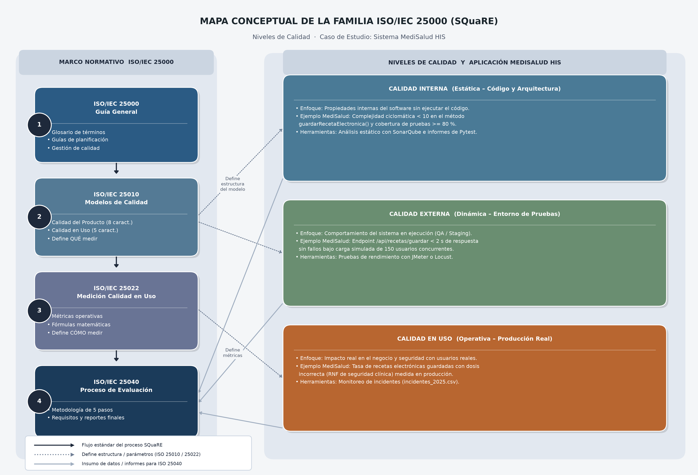

# Escenario 3: Comprensión del Modelo SQuaRE

Este documento detalla el análisis teórico y la aplicación práctica del marco normativo de la familia **ISO/IEC 25000 (SQuaRE)**, enfocándose en la diferenciación de los niveles de calidad y la organización jerárquica de la norma.

---

## 1. Niveles de Calidad: Interna, Externa y en Uso

Bajo la familia de normas ISO/IEC 25000, la calidad del software no se mide en un único plano, sino que se divide en tres niveles complementarios que reflejan distintas etapas del ciclo de vida del producto:

```
[ Calidad Interna ]  =======>  [ Calidad Externa ]  =======>  [ Calidad en Uso ]
(Estática: Código)             (Dinámica: Pruebas)            (Operación: Producción)
```

La evaluación integral del sistema de historia clínica y gestión hospitalaria MediSalud HIS requiere articular la calidad en tres niveles complementarios que transitan desde su infraestructura técnica hasta su impacto clínico y financiero en producción. En el primer nivel, la calidad interna adopta una perspectiva estática enfocada en la robustez estructural de los microservicios en Spring Boot y FastAPI, evaluando el código fuente y los esquemas de bases de datos PostgreSQL mediante análisis estático automatizado para mitigar la deuda técnica. Secuencialmente, la calidad externa examina el comportamiento dinámico del sistema ejecutable en entornos de pruebas controlados (QA/Staging); en esta etapa, el equipo técnico simula transacciones concurrentes o inyecta fallos para medir de forma controlada la latencia de las APIs y verificar requerimientos no funcionales antes del despliegue. Por último, la calidad en uso traslada el foco al escenario operativo real en las cinco ciudades de la red de salud, midiendo en producción el grado en que médicos, enfermeras y pacientes logran completar sus tareas críticas con efectividad, eficiencia y satisfacción. Mientras las dimensiones interna y externa analizan propiedades intrínsecas del producto de software desarrolladas por el área de TI, la calidad en uso mide el impacto tangible de la tecnología en el contexto diario de la organización, sirviendo como la herramienta definitiva para diagnosticar problemas críticos como la lentitud en horas pico de la consulta externa o los errores en el flujo de facturación.

## 2. Tabla 3.2: Ejemplos de Calidad en el Módulo de Receta Médica (MediSalud HIS)

Para comprender cómo interactúan estos tres niveles en el sistema **MediSalud HIS**, se presenta un ejemplo práctico centrado en la funcionalidad de **Registro de Receta Electrónica**:

| Nivel de Calidad    | Ejemplo de Medición Específico en MediSalud HIS                                                                                                                                                                                       | Herramienta / Método de Medición                                                        |
| :------------------ | :------------------------------------------------------------------------------------------------------------------------------------------------------------------------------------------------------------------------------------ | :-------------------------------------------------------------------------------------- |
| **Calidad Interna** | Validar que el código del método `guardarRecetaElectronica()` en el backend de HCE tenga una complejidad ciclomática menor a 10 y que cuente con al menos un 80% de cobertura de pruebas unitarias para asegurar su mantenibilidad.   | Análisis estático de código con **SonarQube** e informes de cobertura de **Pytest**.    |
| **Calidad Externa** | Ejecutar una prueba de carga simulada con 150 usuarios concurrentes (médicos ficticios) en el ambiente de Staging para verificar que el endpoint `/api/recetas/guardar` responda en menos de 2 segundos sin generar fallos 500.       | Simulación de carga usando **JMeter** o **Locust** en un entorno de pruebas controlado. |
| **Calidad en Uso**  | Contabilizar cuántas veces en el mes los médicos reales en producción reportaron que la receta electrónica se guardó con una dosis incorrecta (lo cual infringe el RNF de seguridad clínica y expone al paciente a riesgos de salud). | Monitoreo del archivo de quejas e incidentes en producción (`incidentes_2025.csv`).     |

---

## 3. Mapa Conceptual de la Familia SQuaRE (ISO/IEC 25000)

El siguiente mapa conceptual organiza jerárquicamente las normas clave que componen el estándar SQuaRE, detallando la función específica de cada una y conectándolas directamente con los **tres niveles de calidad** y sus respectivos ejemplos del caso **MediSalud HIS**:



### Relación y Roles de las Normas e Integración de Niveles de Calidad:

1. **ISO/IEC 25000 (Guía General):** Establece el marco común, la terminología estándar y los requisitos para planificar el control de calidad en el proyecto MediSalud HIS. Asegura la alineación de objetivos de negocio con métricas de software.
2. **ISO/IEC 25010 (Modelos de Calidad):** Estructura conceptualmente la calidad en dos dimensiones principales:
   - **Calidad del Producto (Interna/Externa):** Clasifica atributos técnicos del código y la arquitectura (**Calidad Interna**, p. ej., mantenibilidad del método `guardarRecetaElectronica()`) y el comportamiento dinámico observable en pruebas (**Calidad Externa**, p. ej., rendimiento del endpoint `/api/recetas/guardar`).
   - **Calidad en Uso:** Define las dimensiones operativas clave del sistema en el mundo real (Efectividad, Eficiencia, Satisfacción, Libertad de Riesgo y Cobertura de Contexto) en las que se enmarca la interacción de los médicos con la historia clínica electrónica.
3. **ISO/IEC 25022 (Medición de Calidad en Uso):** Traduce el modelo teórico en números reales. Proporciona la metodología y las fórmulas matemáticas para cuantificar el impacto clínico y operativo en producción, como el cálculo de la tasa de fallas en prescripciones críticas mediante el análisis del registro de incidentes (`incidentes_2025.csv`).
4. **ISO/IEC 25040 (Proceso de Evaluación):** Define el proceso paso a paso (establecer requisitos, especificar la evaluación, diseñar la evaluación, ejecutarla y concluirla) para evaluar de forma rigurosa los tres niveles de calidad (Interna, Externa y en Uso), consolidando los reportes de SonarQube, JMeter e incidentes operativos en un veredicto de calidad integral.
