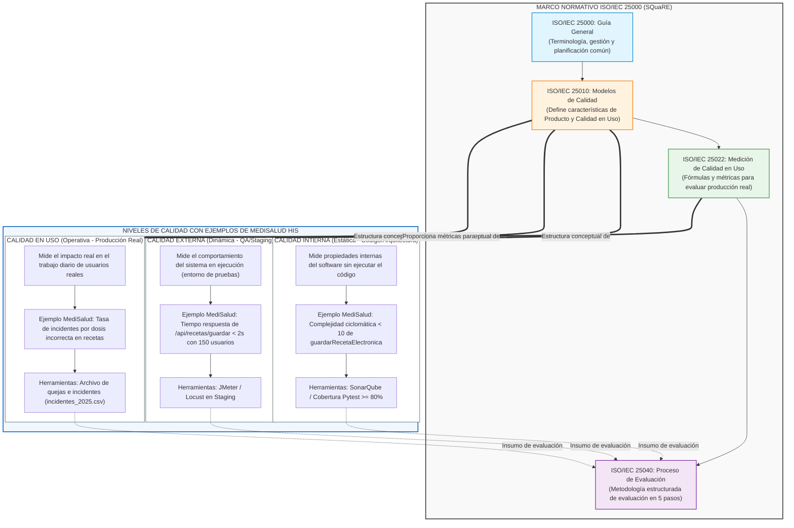

# Escenario 3: Comprensión del Modelo SQuaRE

Este documento detalla el análisis teórico y la aplicación práctica del marco normativo de la familia **ISO/IEC 25000 (SQuaRE)**, enfocándose en la diferenciación de los niveles de calidad y la organización jerárquica de la norma.

---

## 1. Niveles de Calidad: Interna, Externa y en Uso

Bajo la familia de normas ISO/IEC 25000, la calidad del software no se mide en un único plano, sino que se divide en tres niveles complementarios que reflejan distintas etapas del ciclo de vida del producto:

```
[ Calidad Interna ]  =======>  [ Calidad Externa ]  =======>  [ Calidad en Uso ]
(Estática: Código)             (Dinámica: Pruebas)            (Operación: Producción)
```

### A. Calidad Interna (Vista Estática)
*   **Definición:** Evalúa las propiedades del software que no dependen de su ejecución. Se enfoca en el código fuente, la arquitectura, los esquemas de bases de datos y la documentación técnica.
*   **Cómo se mide:** Se evalúa de manera automatizada mediante herramientas de análisis estático (ej. SonarQube, linters, escáneres de seguridad). Mide indicadores como complejidad ciclomática, duplicación de código, adherencia a estándares de codificación (limpieza) y porcentaje de cobertura de pruebas unitarias.
*   **Enfoque:** Desarrolladores y arquitectos de software.

### B. Calidad Externa (Vista Dinámica en Pruebas)
*   **Definición:** Evalúa el comportamiento del software cuando se ejecuta, pero dentro de un entorno de pruebas controlado y simulado (QA / Staging).
*   **Cómo se mide:** Se realiza ejecutando el sistema para validar que cumpla los requisitos funcionales y no funcionales. Mide métricas como tiempos de respuesta bajo carga simulada, comportamiento de la API frente a fallos inyectados, tasas de éxito en pruebas automatizadas de interfaz (ej. Selenium, Cypress) y escaneos de vulnerabilidades activas en ejecución.
*   **Enfoque:** Ingenieros de pruebas (QA), testers y analistas de sistemas.

### C. Calidad en Uso (Vista Operativa Real)
*   **Definición:** Mide el grado en que el software ayuda a usuarios reales a alcanzar sus metas reales en el entorno de producción real, bajo las condiciones cotidianas del negocio.
*   **Cómo se mide:** Se evalúa recolectando datos directamente de la operación diaria (producción). Utiliza registros de incidentes (como quejas de lentitud o errores de cobro), encuestas de satisfacción del cliente (SUS), tasa de abandono de tareas en producción, número de errores cometidos por los usuarios en vivo y pérdidas financieras asociadas a fallos.
*   **Enfoque:** Clientes finales, usuarios de negocio, directores de operaciones y auditores de calidad.

---

## 2. Tabla 3.2: Ejemplos de Calidad en el Módulo de Receta Médica (MediSalud HIS)

Para comprender cómo interactúan estos tres niveles en el sistema **MediSalud HIS**, se presenta un ejemplo práctico centrado en la funcionalidad de **Registro de Receta Electrónica**:

| Nivel de Calidad | Ejemplo de Medición Específico en MediSalud HIS | Herramienta / Método de Medición |
| :--- | :--- | :--- |
| **Calidad Interna** | Validar que el código del método `guardarRecetaElectronica()` en el backend de HCE tenga una complejidad ciclomática menor a 10 y que cuente con al menos un 80% de cobertura de pruebas unitarias para asegurar su mantenibilidad. | Análisis estático de código con **SonarQube** e informes de cobertura de **Pytest**. |
| **Calidad Externa** | Ejecutar una prueba de carga simulada con 150 usuarios concurrentes (médicos ficticios) en el ambiente de Staging para verificar que el endpoint `/api/recetas/guardar` responda en menos de 2 segundos sin generar fallos 500. | Simulación de carga usando **JMeter** o **Locust** en un entorno de pruebas controlado. |
| **Calidad en Uso** | Contabilizar cuántas veces en el mes los médicos reales en producción reportaron que la receta electrónica se guardó con una dosis incorrecta (lo cual infringe el RNF de seguridad clínica y expone al paciente a riesgos de salud). | Monitoreo del archivo de quejas e incidentes en producción (`incidentes_2025.csv`). |

---

## 3. Mapa Conceptual de la Familia SQuaRE (ISO/IEC 25000)

El siguiente mapa conceptual organiza jerárquicamente las normas clave que componen el estándar SQuaRE, detallando la función específica de cada una y conectándolas directamente con los **tres niveles de calidad** y sus respectivos ejemplos del caso **MediSalud HIS**:



### Relación y Roles de las Normas e Integración de Niveles de Calidad:

1. **ISO/IEC 25000 (Guía General):** Establece el marco común, la terminología estándar y los requisitos para planificar el control de calidad en el proyecto MediSalud HIS. Asegura la alineación de objetivos de negocio con métricas de software.
2. **ISO/IEC 25010 (Modelos de Calidad):** Estructura conceptualmente la calidad en dos dimensiones principales:
   * **Calidad del Producto (Interna/Externa):** Clasifica atributos técnicos del código y la arquitectura (**Calidad Interna**, p. ej., mantenibilidad del método `guardarRecetaElectronica()`) y el comportamiento dinámico observable en pruebas (**Calidad Externa**, p. ej., rendimiento del endpoint `/api/recetas/guardar`).
   * **Calidad en Uso:** Define las dimensiones operativas clave del sistema en el mundo real (Efectividad, Eficiencia, Satisfacción, Libertad de Riesgo y Cobertura de Contexto) en las que se enmarca la interacción de los médicos con la historia clínica electrónica.
3. **ISO/IEC 25022 (Medición de Calidad en Uso):** Traduce el modelo teórico en números reales. Proporciona la metodología y las fórmulas matemáticas para cuantificar el impacto clínico y operativo en producción, como el cálculo de la tasa de fallas en prescripciones críticas mediante el análisis del registro de incidentes (`incidentes_2025.csv`).
4. **ISO/IEC 25040 (Proceso de Evaluación):** Define el proceso paso a paso (establecer requisitos, especificar la evaluación, diseñar la evaluación, ejecutarla y concluirla) para evaluar de forma rigurosa los tres niveles de calidad (Interna, Externa y en Uso), consolidando los reportes de SonarQube, JMeter e incidentes operativos en un veredicto de calidad integral.

